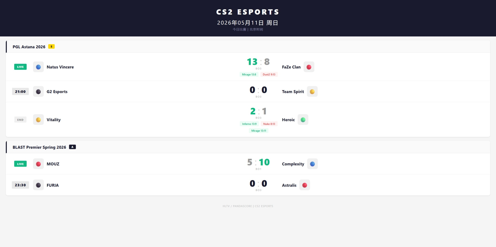

# CS2 赛事查询插件

AstrBot 插件，查询 CS2 赛事信息。支持 PandaScore API 和自部署 HLTV API 两种数据源。



## 功能

- **今日比赛** — `/cs2` 一键查看今天所有 CS2 大赛，按赛事分组展示
- **赛事等级过滤** — 只显示指定等级以上的赛事（PandaScore）
- **实时比分** — 进行中的比赛显示 LIVE 状态
- **比赛详情** — 大比分 + 每张地图小分
- **北京时间** — 所有时间自动转为北京时间 (UTC+8)
- **五杀推送** — 后台监控进行中比赛，检测到五杀时推送通知
- **双数据源** — 支持 PandaScore API 和自部署 HLTV API，可在设置中切换

## 数据源对比

| 特性 | PandaScore（免费） | HLTV API（自部署） |
|------|-------------------|-------------------|
| 比赛列表 | ✅ | ✅ |
| 赛事名称 | ✅ | ✅ |
| 队伍 LOGO | ✅ | ✅ |
| 比赛详情 | ❌ (403) | ✅ |
| 地图小分 | ❌ (403) | ✅ |
| 击杀事件 | ❌ (需 Pro) | ❌ |
| 部署要求 | 无需部署 | 需要 Docker |
| 价格 | 免费（有限制） | 完全免费 |

## 命令

| 命令 | 说明 |
|------|------|
| `/cs2` | 今日比赛（按赛事分组） |
| `/cs2 live` | 正在进行的比赛 |
| `/cs2 upcoming` | 即将开始的比赛 |
| `/cs2 recent` | 最近结束的比赛 |
| `/cs2 match <ID>` | 比赛详情 |
| `/cs2 major` | S/A 级赛事列表 |

## 安装

1. 下载插件压缩包
2. 解压到 AstrBot 的 `data/plugins/` 目录（目录名 `astrbot_plugin_cs2`）
3. 在 AstrBot WebUI 插件管理页重载插件
4. 依赖自动安装（aiohttp, aiosqlite）

## 配置

在 AstrBot WebUI 插件设置页配置：

| 配置项 | 类型 | 默认值 | 说明 |
|--------|------|--------|------|
| `data_source` | 选择 | pandascore | 数据源：`pandascore` 或 `hltv` |
| `pandascore_token` | string | — | PandaScore API Token |
| `hltv_api_url` | string | http://localhost:8000 | HLTV API 地址 |
| `min_tier` | 选择 | a | 最低赛事等级（仅PandaScore） |
| `ace_push_enabled` | 开关 | true | 启用五杀推送 |
| `ace_poll_interval` | 数字 | 1800 | 轮询间隔（秒） |
| `push_groups` | 列表 | [] | 推送目标群 ID |

## 部署 HLTV API（可选）

需要 Docker 环境：

```bash
git clone https://github.com/eupeutro/hltv-api.git
cd hltv-api
docker compose up -d --build
```

服务启动后在插件设置中：
- 数据源选择 `hltv`
- HLTV API 地址填 `http://localhost:8000`

如果 AstrBot 也在 Docker 中，需要在同一网络或使用宿主机 IP。

## 插件加载检测

插件加载时自动检测所选数据源的连通性：
- 成功 → 日志显示连接信息
- 失败 → 日志显示错误提示

## 依赖

- `aiohttp>=3.9.0`
- `aiosqlite>=0.19.0`

AstrBot 加载插件时自动安装。

## 数据源

- [PandaScore API](https://developers.pandascore.co/) — 官方 REST API
- [HLTV API](https://github.com/eupeutro/hltv-api) — 自部署 HLTV 爬虫服务

## 许可

MIT
AGL3.0
